# Route Gradient Sidecar Architecture

这份文档按 EDA timer/router 侧的架构视角组织。先看系统边界和调用图，再看参数契约、dataflow、struct 语义和计算过程；最后的函数索引用于查细节。

`route_grad` 是一个独立 sidecar。它不进入正常 DMP timing/power forward path，而是在 OpenROAD route-segment RC 图上重跑 DMP timing，构造 soft endpoint timing objective 的反向传播链条，并输出每个 route edge/node 的 R/C 梯度。

## 1. System Boundary

| 项 | 说明 |
| --- | --- |
| 输入 | OpenROAD route segment file，里面描述每个 net 的 route tree edge/node RC |
| 前向模型 | DMP RC propagation + DMP timing，使用当前 timer DB/liberty/DMP model |
| 目标函数 | `tau * logsumexp((AT_endpoint - RAT_endpoint) / tau)`，当前只 seed late endpoint attrs |
| 输出 | `edge_res_grad`, `node_cap_grad`, `edge_cap_grad` 三个 `torch::Tensor` |
| 主要用途 | 验证和研究 timing-driven routing cost 的解析导数 |
| 不做什么 | 不修改正常 timer/power path；不在 routing resource constraint 上求 KKT；不直接求最优 routing |

## 2. Top-Level Call Flow

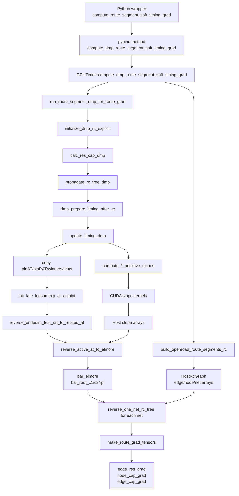

## 3. Public API Contract

### Main Analytic API

```cpp
std::tuple<torch::Tensor, torch::Tensor, torch::Tensor>
GPUTimer::compute_dmp_route_segment_soft_timing_grad(
    const std::string& route_segments_file,
    double tau_ns);
```

| 参数 | 意义 | 约束 |
| --- | --- | --- |
| `route_segments_file` | OpenROAD route segment RC 文件路径 | 不能为空；必须能被 `build_openroad_route_segments_rc()` 解析 |
| `tau_ns` | softmax/logsumexp temperature，单位 ns | 必须为 positive finite；越小越接近 max endpoint violation，越大越平均 |

| 返回 tensor | shape | 对齐方式 | 含义 |
| --- | --- | --- | --- |
| `edge_res_grad` | `[graph.num_edges]` | `HostRcGraph.edge_*` edge id | `dObjective / d(edge_res[edge])` |
| `node_cap_grad` | `[graph.num_nodes]` | `HostRcGraph.node_*` node id | `dObjective / d(node_cap[node])`，四个 attr 的贡献合并到一个 node scalar |
| `edge_cap_grad` | `[graph.num_edges]` | `HostRcGraph.edge_*` edge id | derived edge cap gradient，当前为 edge 两端 node cap gradient 的平均值 |

Python wrapper:

```python
TimerOpt.compute_route_segment_soft_timing_grad(route_segments_file=None, tau_ns=0.02)
```

### Validation APIs

| API | 验证范围 | 代价 | 何时用 |
| --- | --- | --- | --- |
| `debug_dmp_route_segment_primitive_slope_stats()` | primitive analytic coverage 和 failure bucket | 低 | 看 PI/CAP/zero-C2 primitive 是否大面积 analytic 成功 |
| `debug_dmp_route_segment_rc_tree_gradcheck()` | 固定 topology 的 RC tree reverse | 中 | 单独验证 Elmore/root PI 到 edge/node RC 的 reverse 是否正确 |
| `debug_dmp_route_segment_grad_fd_validate()` | 完整 objective sampled FD vs analytic | 高 | 端到端验证某批 route edge/node 的梯度方向和数值 |

## 4. File Layout

```text
route_grad/
  DmpRouteGrad.h                  public route-grad options
  DmpRouteGradHost.h              host RAII buffers and host slope containers
  DmpRouteGradInternal.h          private cross-file host declarations
  DmpRouteGradDevice.cuh          device structs and kernel declarations
  DmpRouteGradDeviceInternal.cuh  small device helpers shared by .cu files

  DmpRouteGrad.cu                 public API, DMP sidecar run, timing reverse
  DmpRouteGradRcTree.cu           RC-tree reverse and finite-difference validation
  DmpRouteGradDevice.cu           shared device math and PI/zero-C2 implicit derivatives
  DmpRouteGradDevicePrimitive.cu  primitive reconstruction and local FD helpers
  DmpRouteGradDeviceWave.cu       waveform crossing derivatives and gate chain rule
  DmpRouteGradDeviceKernels.cu    CUDA slope writer kernels
```

## 5. Dataflow Objects

### Route Graph Data

`HostRcGraph` is produced by `build_openroad_route_segments_rc()` and is the indexing backbone of the whole sidecar.

| Field family | Role |
| --- | --- |
| `edge_from`, `edge_to`, `edge_res` | route tree edges and edge resistance |
| `node_cap` | per-node capacitance, laid out as `node * NUM_ATTR + attr` |
| `node2pin` | maps route node to timing pin, or negative if no timing pin |
| `net2node_start`, `net2edge_start` | CSR-style net ranges for route nodes and edges |
| `includes_pin_caps` | tells whether `node_cap` already includes timing pin capacitance |

Important index convention:

```text
pin slot  = pin_id  * NUM_ATTR + attr
node slot = node_id * NUM_ATTR + attr
arc work item = arc_id * NUM_ATTR + attr
```

### Forward Timing State Copied From DMP

| Array | Meaning in this sidecar |
| --- | --- |
| `pinAT`, `pinRAT`, `pinSlew` | baseline DMP timing values after route-segment RC is loaded |
| `at_prefix_pin/arc/attr` | active predecessor that produced each `pinAT` slot |
| `arc_types` | distinguishes net arcs and gate arcs in reverse timing traversal |
| `testRelatedAT`, `testRAT`, `arc_id2test_id` | RAT/test reverse support |
| `elmore_delay`, `C1`, `C2`, `r_pi` | local RC outputs used by primitive reconstruction and RC reverse |

### Adjoint Arrays

| Adjoint | Shape | Meaning |
| --- | --- | --- |
| `bar_pin_at` | `num_pins * NUM_ATTR` | objective adjoint on pin arrival time |
| `bar_pin_rat` | `num_pins * NUM_ATTR` | objective adjoint on pin required arrival time |
| `bar_pin_slew` | `num_pins * NUM_ATTR` | adjoint on pin slew, produced by gate/net primitive chain |
| `bar_elmore` | `num_pins * NUM_ATTR` | adjoint on sink Elmore delay |
| `bar_root_c1` | `num_pins * NUM_ATTR` | adjoint on driver/root PI `C1` |
| `bar_root_c2` | `num_pins * NUM_ATTR` | adjoint on driver/root PI `C2` |
| `bar_root_rpi` | `num_pins * NUM_ATTR` | adjoint on driver/root PI `rpi` |

## 6. Main Computation Process

### 6.1 Objective Seed

For each endpoint pin and late attr selected by the code, define:

```text
value_i = (AT_i - RAT_i) * time_to_ns
Y       = tau_ns * log(sum_i exp(value_i / tau_ns))
weight_i = softmax(value_i / tau_ns)
```

Reverse seed:

```text
bar_pin_at[i]  += weight_i * time_to_ns
bar_pin_rat[i] -= weight_i * time_to_ns
```

Design implication: endpoint aggregation is soft, so near-critical endpoints still receive non-zero weight. The subsequent timing graph traversal still follows the active DMP timing winners recorded in `at_prefix_*` and the local primitive branch chosen by DMP.

### 6.2 RAT/Test Reverse

`reverse_endpoint_test_rat_to_related_at()` handles the endpoint required-time side:

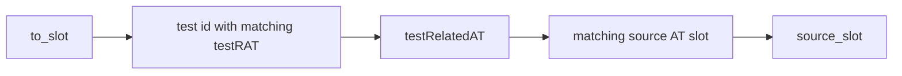

The code uses `nearly_equal_time()` because the related AT can match directly, with period shift, or half-period shift depending on the test relationship.

### 6.3 Primitive Slope Preparation

Primitive slopes are local Jacobian pieces needed by timing reverse. They are computed before host timing reverse so the host walk only needs array lookups.

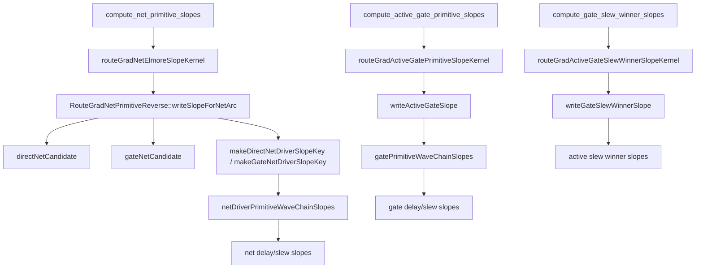

Outputs are compact host arrays:

| Slope container | Produced by | Consumed by |
| --- | --- | --- |
| `RouteGradNetSlopesHost` | `routeGradNetElmoreSlopeKernel` | net arc branch in `reverse_active_at_to_elmore()` |
| `RouteGradActiveGateSlopesHost` | `routeGradActiveGatePrimitiveSlopeKernel` | gate delay branch in `reverse_active_at_to_elmore()` |
| `RouteGradGateSlewWinnerSlopesHost` | `routeGradActiveGateSlewWinnerSlopeKernel` | gate slew branch in `reverse_active_at_to_elmore()` |

### 6.4 Timing Reverse

`reverse_active_at_to_elmore()` walks pins in reverse level order and follows DMP active predecessor metadata.

```mermaid
flowchart TD
    PinAdj[bar_pin_at / bar_pin_slew at to_slot] --> Winner[at_prefix_pin/arc/attr]
    Winner --> IsNet{arc_types[arc] == net?}
    IsNet -- yes --> NetSlope[RouteGradNetSlopesHost]
    NetSlope --> BE[bar_elmore[to_slot]]
    NetSlope --> BR[bar_root_c1/c2/rpi[root_slot]]
    NetSlope --> BS[bar_pin_slew[input_slew_slot]]
    IsNet -- no --> GateSlope[RouteGradActiveGateSlopesHost + RouteGradGateSlewWinnerSlopesHost]
    GateSlope --> BR
    GateSlope --> BS
    PinAdj --> ParentAT[bar_pin_at[from_slot]]
```

For net arcs, the reverse uses:

```text
bar_elmore[to] += bar_at[to]   * dNetDelay/dElmore
bar_elmore[to] += bar_slew[to] * dNetSlew/dElmore
bar_root_*     += bar_at/slew  * dDelayOrSlew/dRootParam
bar_pin_slew   += bar_at/slew  * dDelayOrSlew/dInputSlew
bar_pin_at[from] += bar_pin_at[to]
```

For gate arcs, the reverse uses gate primitive slopes instead of net Elmore slopes, then propagates AT to the gate input slot.

### 6.5 Gate/Net Primitive Chain

Primitive reconstruction follows the DMP branch that produced the current timing value.

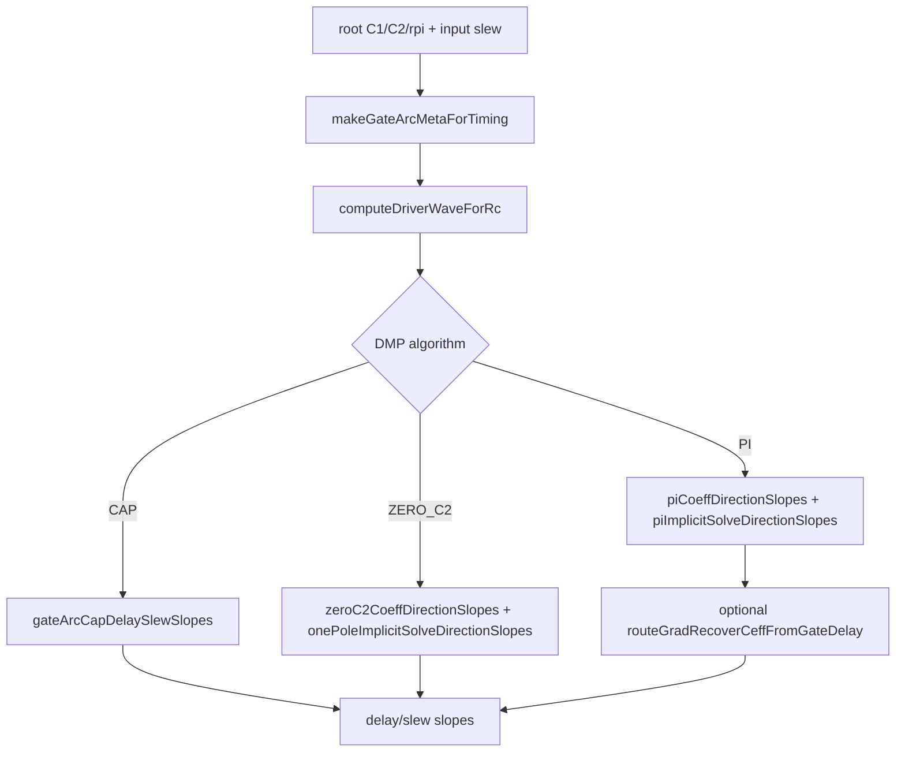

Key point: this code is branch-local analytic differentiation. It differentiates the selected DMP primitive branch. It does not currently smooth the local max/min branch selection among primitive candidates.

### 6.6 RC-Tree Reverse

`reverse_one_net_rc_tree()` maps timing adjoints from pins/root PI quantities back to route RC objects.

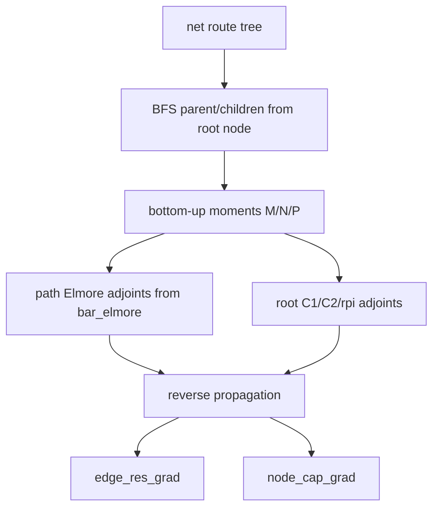

The pass has three conceptual parts:

1. Build a rooted tree for the net from `net2node_start/net2edge_start`.
2. Bottom-up compute moment quantities `M/N/P` and path Elmore dependencies.
3. Reverse adjoints through path delay and root PI formulas into edge resistance and node capacitance.

`edge_res_grad` is scaled by `rc_time_factor = res_unit * cap_unit / time_unit()`. `node_cap_grad` accumulates across attrs into one scalar per route node. `edge_cap_grad` is not independently reverse-propagated; it is derived as the average of the two endpoint node-cap gradients for each edge.

## 7. Core Function Parameter Contracts

### `run_route_segment_dmp_for_route_grad(GPUTimer& timer, HostRcGraph& graph)`

| 参数 | Meaning |
| --- | --- |
| `timer` | Owns timing DB, DMP DB pointers, units, and timing arrays |
| `graph` | Explicit route RC graph loaded from route segment file |

Effect: frees old sidecar DMP state, initializes explicit RC, propagates RC, prepares DMP timing data, runs `update_timing_dmp()`, then synchronizes CUDA.

### `compute_net_primitive_slopes(GPUTimer& timer, unsigned long long* primitive_stats)`

| 参数 | Meaning |
| --- | --- |
| `timer` | Must already have `timer.dmp_db` initialized by the sidecar run |
| `primitive_stats` | Optional device counter array; null means compute slopes without stats |

Returns `RouteGradNetSlopesHost`. It allocates temporary GPU arrays, launches `routeGradNetElmoreSlopeKernel`, copies the arrays back, and lets RAII buffers free device memory.

### `init_late_logsumexp_at_adjoint(...)`

| 参数 | Meaning |
| --- | --- |
| `pin_at`, `pin_rat` | Host copies of DMP `pinAT/pinRAT` |
| `tau_ns` | Softmax temperature in ns |
| `bar_pin_at`, `bar_pin_rat` | Output adjoint arrays updated in place |

The function throws if `tau_ns` is invalid or no finite late endpoint values are available.

### `reverse_active_at_to_elmore(...)`

| 参数 group | Meaning |
| --- | --- |
| `level_list` | Reverse topological traversal order |
| `at_prefix_*`, `arc_types` | Active predecessor/winner metadata from DMP timing |
| `net_slopes` | Net delay/slew local slopes from CUDA kernels |
| `active_gate_slopes` | Gate delay/output slew slopes for active gate arc |
| `gate_slew_slopes` | Active gate output slew winner slopes |
| `bar_pin_at`, `bar_pin_slew` | In/out timing adjoints |
| `bar_elmore`, `bar_root_*` | Output adjoints for RC reverse |

### `reverse_one_net_rc_tree(...)`

| 参数 | Meaning |
| --- | --- |
| `net_id` | Net whose route tree is reversed |
| `rc_time_factor` | Converts route R*C units into timer time units |
| `bar_elmore` | Sink Elmore adjoints indexed by timing pin slot |
| `bar_root_c1/c2/rpi` | Root PI adjoints indexed by root pin slot |
| `edge_res_grad`, `node_cap_grad` | Output gradient vectors accumulated in place |

### `make_route_grad_tensors(...)`

| 参数 | Meaning |
| --- | --- |
| `edge_res_grad` | Host vector of edge resistance gradients |
| `node_cap_grad` | Host vector of node capacitance gradients |

Returns cloned CPU `torch::Tensor`s. `edge_cap_grad` is derived by averaging endpoint node gradients.

## 8. Struct Design Guide

### Host Structs

| Struct | What it owns | Why it exists |
| --- | --- | --- |
| `RouteGradDeviceFloatBuffer` | One temporary device `float*` | RAII cleanup for slope arrays; avoids leaks on exceptions |
| `RouteGradDeviceIntBuffer` | One temporary device `int*` | Same for root/input slot arrays |
| `RouteGradDeviceU64Buffer` | One temporary device counter array | Primitive stats are optional and scoped to stats API |
| `RouteGradNetSlopesHost` | Net delay/slew slopes plus root/input slots | Host timing reverse needs compact random-access local Jacobians |
| `RouteGradActiveGateSlopesHost` | Active gate delay/slew slopes | Separates gate primitive root RC effects from net primitive effects |
| `RouteGradGateSlewWinnerSlopesHost` | Active output slew winner slopes | Slew winner can differ from delay winner, so it has separate slots |
| `RouteGradEndpointValue` | Endpoint slot and scalar objective value | Temporary objective seed representation |
| `RouteGradRcTreeCheckSample` | Net/edge/node tuple | RC-tree-only validation sample |
| `RouteGradFdSample` | Net/edge/node tuple | Full objective FD validation sample |

### Device Structs

| Struct | What it represents | Design note |
| --- | --- | --- |
| `RouteGradLutSlopes` | LUT value and two partials | Used by CAP branch and Rd reconstruction |
| `RouteGradWaveParamSlopes` | Slope vector over waveform params | Kept compact so dot/clear/scale are local and readable |
| `RouteGradPiCoeffSlopes` | PI coefficient directional derivative | Separates waveform params from current coefficients |
| `RouteGradPiSolveSlopes` | PI implicit solve output derivative | Carries waveform, `ceff`, and gate delay slopes together |
| `RouteGradOnePoleSolveSlopes` | zero-C2 solve output derivative | Smaller than PI solve state, avoids unused fields |
| `RouteGradDelaySlewWaveSlopes` | Delay/slew waveform slope pair | Used after crossing differentiation |
| `RouteGradNetDriverWaveEval` | Reconstructed driver waveform candidate | Stores waveform plus enough metadata for downstream net slope |
| `RouteGradNetDriverSlopeKey` | Compact identity of driver-root dependency | Avoids keeping large candidate objects live across winner selection |
| `RouteGradGatePrimitiveSlopes` | Final primitive slopes vs root/input | Common return type for gate and net-driver primitive derivatives |
| `RouteGradNetPrimitiveReverse` | Main operation object for net primitive kernels | Holds only pointers to output arrays and `DmpModel`; member funcs split implementation by step |
| `RouteGradActiveGatePrimitiveSlope` | Operation object for active gate slope kernel | Narrower than `RouteGradNetPrimitiveReverse` to reduce live state |
| `RouteGradActiveGateSlewWinnerSlope` | Operation object for slew winner kernel | Separate because slew winner needs `input_slew_slot` and only slew slopes |

## 9. File Responsibilities

| File | Responsibility | Main readers |
| --- | --- | --- |
| `DmpRouteGrad.cu` | Public API, DMP sidecar lifecycle, primitive slope launch, objective seed, timing reverse | Anyone debugging end-to-end gradient |
| `DmpRouteGradRcTree.cu` | Host RC-tree reverse and FD validation | Anyone checking edge/node RC gradients |
| `DmpRouteGradDevice.cu` | Shared device math, PI/zero-C2 implicit derivative | Anyone touching driver waveform solve derivatives |
| `DmpRouteGradDevicePrimitive.cu` | Threshold/LUT helpers and primitive candidate reconstruction | Anyone matching DMP forward branch behavior |
| `DmpRouteGradDeviceWave.cu` | Waveform value/crossing partials and gate chain rule | Anyone debugging delay/slew slope math |
| `DmpRouteGradDeviceKernels.cu` | Final device slope writers and CUDA kernels | Anyone debugging missing or bad slope output arrays |

## 10. Extension Points

| Change | Where to start | What to preserve |
| --- | --- | --- |
| Change objective | `init_late_logsumexp_at_adjoint()` | Keep output as adjoints on `bar_pin_at/bar_pin_rat` |
| Add objective term depending on slew | Seed `bar_pin_slew` before `reverse_active_at_to_elmore()` | Make sure local slew slopes exist for the relevant winner |
| Add power term depending on cap/slew | Seed root/node/pin adjoints explicitly, likely before RC reverse | Keep power code outside normal timer/power path unless intentionally integrated |
| Smooth local timing winners | `writeSlopeForNetArc()` and gate slew winner path | Current code is branch-local; smoothing changes semantics and validation expectations |
| Add new primitive model | `DmpRouteGradDevicePrimitive.cu` and `DmpRouteGradDeviceWave.cu` | Reconstruct the same forward branch before differentiating it |
| Move RC reverse to GPU | `DmpRouteGradRcTree.cu` + `RouteGradRcTreeReverse` | Preserve validation API and host-readable debug path |

## 11. Validation Strategy

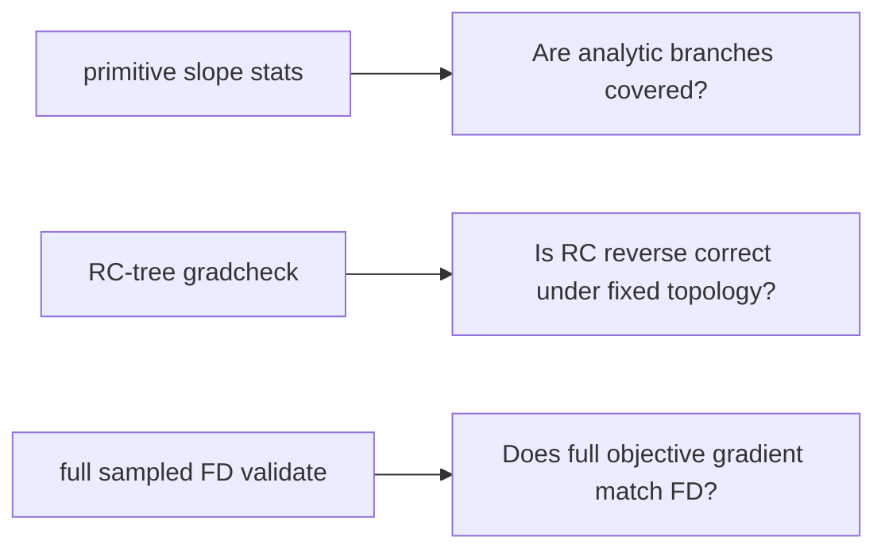

Use them in this order:

1. `debug_dmp_route_segment_primitive_slope_stats()` to catch missing analytic primitive branches.
2. `debug_dmp_route_segment_rc_tree_gradcheck()` to isolate RC-tree math from timing winner instability.
3. `debug_dmp_route_segment_grad_fd_validate()` to compare sampled end-to-end FD with analytic gradient.

## 12. Exhaustive Analytic Function Flow

This section is the complete flow inventory. It intentionally lists every route-gradient function in this directory, including small helpers and RAII methods. The goal is to answer four questions for each function:

| Column | Meaning |
| --- | --- |
| Function | Exact function or grouped method name |
| Upstream | Who calls it or which phase owns it |
| Data in | Important input state or parameters |
| Data out / effect | Returned value, mutated adjoint, written slope array, or validation output |

### 12.1 End-to-End Host Flow

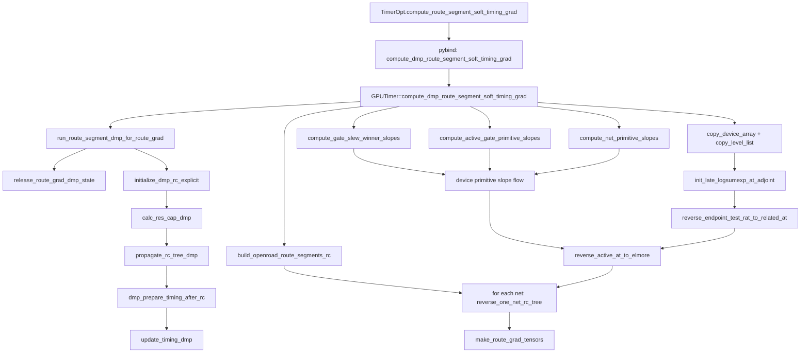

| Function | Upstream | Data in | Data out / effect |
| --- | --- | --- | --- |
| `TimerOpt.compute_route_segment_soft_timing_grad()` | Python caller | optional `route_segments_file`, `tau_ns`; fallback path from params | Calls pybind method and returns three tensors. Defined in `src/core/timing_opt.py` and `timer_only/timing_opt.py`. |
| `GPUTimer::compute_dmp_route_segment_soft_timing_grad()` | pybind | route segment path, `tau_ns`, existing timer DB/liberty state | Orchestrates the full analytic derivative chain and returns `edge_res_grad`, `node_cap_grad`, `edge_cap_grad`. |
| `route_grad_cuda_check()` | Any host CUDA runtime call in this sidecar | `cudaError_t`, label | Throws with labeled context on CUDA failure. |
| `RouteGradDeviceFloatBuffer::RouteGradDeviceFloatBuffer()` | Stack allocation in host slope wrappers | none | Initializes `ptr=nullptr`. |
| `RouteGradDeviceFloatBuffer::~RouteGradDeviceFloatBuffer()` | Scope exit | `ptr` | Frees device float buffer if allocated. |
| `RouteGradDeviceFloatBuffer::allocate()` | Host slope wrappers | count, label | Allocates device float array. |
| `RouteGradDeviceIntBuffer::RouteGradDeviceIntBuffer()` | Stack allocation in host slope wrappers | none | Initializes `ptr=nullptr`. |
| `RouteGradDeviceIntBuffer::~RouteGradDeviceIntBuffer()` | Scope exit | `ptr` | Frees device int buffer if allocated. |
| `RouteGradDeviceIntBuffer::allocate()` | Host slope wrappers | count, label | Allocates device int array. |
| `RouteGradDeviceU64Buffer::RouteGradDeviceU64Buffer()` | Primitive stats API | none | Initializes `ptr=nullptr`. |
| `RouteGradDeviceU64Buffer::~RouteGradDeviceU64Buffer()` | Scope exit | `ptr` | Frees device stats buffer if allocated. |
| `RouteGradDeviceU64Buffer::allocate()` | Primitive stats API | counter count, label | Allocates device `unsigned long long` counter array. |
| `release_route_grad_dmp_state()` | `run_route_segment_dmp_for_route_grad()` | `timer.h_dmp_db`, `timer.dmp_db` | Releases previous route-gradient DMP state. |
| `run_route_segment_dmp_for_route_grad()` | Main analytic API and stats APIs | `GPUTimer`, `HostRcGraph` explicit RC arrays | Reinitializes route RC in DMP, runs RC propagation and DMP timing, synchronizes CUDA. |
| `copy_device_array<T>()` | Main analytic API and helpers | device pointer, element count, label | Host `std::vector<T>` copy with null/CUDA checks. |
| `copy_level_list()` | Main analytic API | `timer.level_list`, `level_list_end_cpu` | Host copy of levelized timing traversal order. |
| `graph_includes_pin_caps()` | `node_cap_with_optional_pin()` | `HostRcGraph`, `net_id` | Boolean telling whether node caps already include pin cap. |

### 12.2 Primitive Slope Host Flow

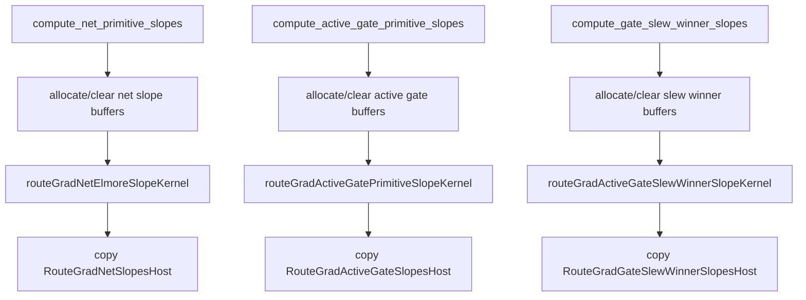

| Function | Upstream | Data in | Data out / effect |
| --- | --- | --- | --- |
| `compute_net_primitive_slopes()` | Main analytic API; primitive stats API | initialized `timer.dmp_db`, optional `primitive_stats` | Returns `RouteGradNetSlopesHost`: net delay/slew Elmore slopes, driver root slots, driver input slew slots, and root PI/input-slew slopes. |
| `compute_active_gate_primitive_slopes()` | Main analytic API; primitive stats API | initialized `timer.dmp_db`, optional `primitive_stats` | Returns `RouteGradActiveGateSlopesHost`: active gate delay/output slew slopes vs root `C1/C2/rpi/input_slew`. |
| `compute_gate_slew_winner_slopes()` | Main analytic API; primitive stats API | initialized `timer.dmp_db`, optional `primitive_stats` | Returns `RouteGradGateSlewWinnerSlopesHost`: active gate output slew winner slots and slopes. |
| `dmp_route_segment_primitive_slope_stat_columns()` | Primitive stats API | none | Column names for primitive analytic/failure counters. |
| `GPUTimer::debug_dmp_route_segment_primitive_slope_stats()` | Python/debug caller | route segment path | Runs DMP and primitive slope kernels with device counters; returns counter tensor and column names. |

### 12.3 Objective And Timing Reverse Flow

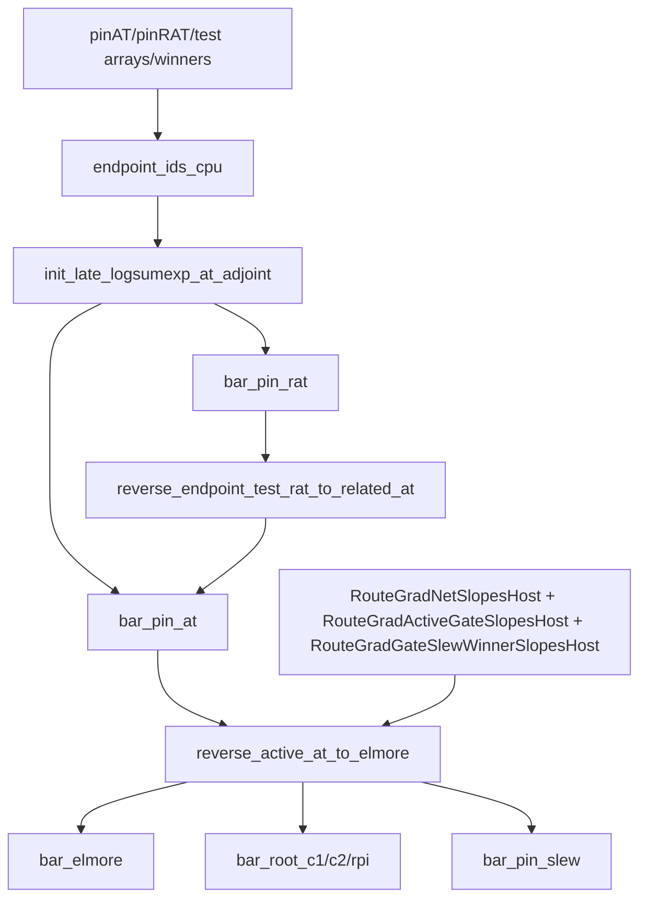

| Function | Upstream | Data in | Data out / effect |
| --- | --- | --- | --- |
| `endpoint_ids_cpu()` | `init_late_logsumexp_at_adjoint()` | endpoint tensors in `TimingTorchRawDB` | CPU vector of unique endpoint pin ids. |
| `init_late_logsumexp_at_adjoint()` | Main analytic API | host `pin_at`, `pin_rat`, `tau_ns` | Seeds `bar_pin_at` and `bar_pin_rat` using softmax over endpoint `(AT-RAT)`. |
| `nearly_equal_time()` | RAT/test reverse | two timing floats | Robust comparison for matching RAT and related AT values. |
| `reverse_endpoint_test_rat_to_related_at()` | Main analytic API after objective seed | `bar_pin_rat`, test arrays, backward arc lists, timing arc endpoints | Moves RAT adjoints back to related source AT slots. |
| `reverse_active_at_to_elmore()` | Main analytic API after RAT reverse | reverse level list, active predecessor arrays, arc types, three slope containers, timing adjoints | Accumulates `bar_elmore`, `bar_root_c1/c2/rpi`, and `bar_pin_slew`; also propagates `bar_pin_at` upstream. |

### 12.4 Device Net Primitive Slope Flow

This path computes local Jacobians for net arcs. It is branch-local: it reconstructs the same candidate/winner DMP selected, then differentiates that branch.

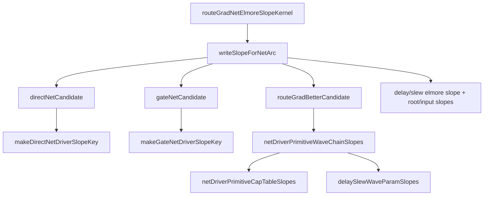

| Function | Upstream | Data in | Data out / effect |
| --- | --- | --- | --- |
| `routeGradNetElmoreSlopeKernel()` | `compute_net_primitive_slopes()` | `RouteGradNetPrimitiveReverse op` | One thread per arc/attr; calls `writeSlopeForNetArc()`. |
| `RouteGradNetPrimitiveReverse::writeSlopeForNetArc()` | `routeGradNetElmoreSlopeKernel()` | net arc id, attr, DMP timing arrays | Selects delay and slew primitive winners, writes Elmore/root/input-slew slopes to output arrays, updates stats. |
| `RouteGradNetPrimitiveReverse::directNetCandidate()` | `writeSlopeForNetArc()` | net arc, attr, source slew, sink Elmore | Reconstructs direct net delay/load slew and scalar Elmore slopes. |
| `RouteGradNetPrimitiveReverse::gateNetCandidate()` | `writeSlopeForNetArc()` | gate arc, net arc, attr, input transition | Reconstructs gate-driven net candidate and Elmore slopes. |
| `RouteGradNetPrimitiveReverse::makeDirectNetDriverSlopeKey()` | `writeSlopeForNetArc()` | direct net arc, attr | Builds key identifying direct driving-cell root dependency; returns threshold-adjust input-slew slopes. |
| `RouteGradNetPrimitiveReverse::makeGateNetDriverSlopeKey()` | `writeSlopeForNetArc()` | gate arc, net arc, attr, input transition | Builds key identifying gate-net pair root dependency. |
| `RouteGradNetPrimitiveReverse::netDriverWaveForKey()` | `netDriverPrimitiveWaveChainSlopes()` and FD helper | `RouteGradNetDriverSlopeKey`, root RC, input slew | Reconstructs driver waveform, thresholds, Elmore, timing id, and load pin metadata. |
| `RouteGradNetPrimitiveReverse::netDriverDelaySlewForKey()` | `netDriverPrimitiveFiniteDiff()` | slope key, perturbed root RC/input slew | Recomputes downstream net delay/slew for local FD diagnostics. |
| `RouteGradNetPrimitiveReverse::netDriverPrimitiveWaveChainSlopes()` | `writeSlopeForNetArc()` | `RouteGradNetDriverSlopeKey` | Analytic chain rule from driver-root `C1/C2/rpi/input_slew` to downstream net delay/slew. |
| `RouteGradNetPrimitiveReverse::netDriverPrimitiveCapTableSlopes()` | `netDriverPrimitiveWaveChainSlopes()` CAP branch | slope key, reconstructed eval, gate arc LUT meta, root `C1/C2` | CAP-table derivative for downstream net delay/slew. |
| `RouteGradNetPrimitiveReverse::netDriverPrimitiveFiniteDiff()` | debug/local validation path | slope key | Local FD slopes for net-driver primitive; not part of normal analytic output. |
| `RouteGradNetPrimitiveReverse::classifyNetDriverPrimitiveAlg()` | stats/debug classification path | slope key | Reconstructs DMP algorithm id for net-driver primitive. |

### 12.5 Device Gate Primitive And Waveform Flow

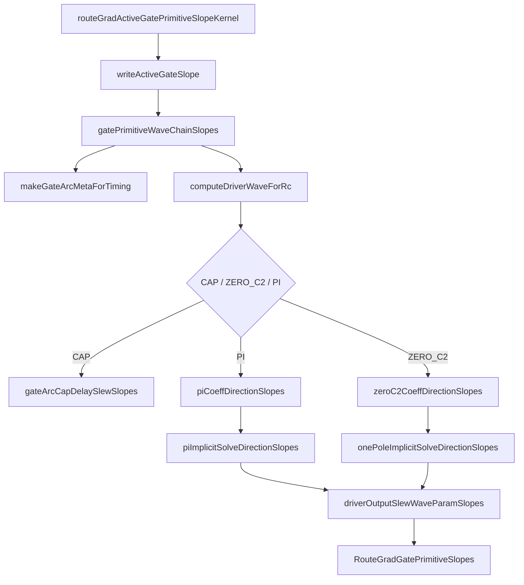

| Function | Upstream | Data in | Data out / effect |
| --- | --- | --- | --- |
| `routeGradActiveGatePrimitiveSlopeKernel()` | `compute_active_gate_primitive_slopes()` | `RouteGradActiveGatePrimitiveSlope op` | One thread per pin slot; calls `writeActiveGateSlope()`. |
| `RouteGradActiveGatePrimitiveSlope::writeActiveGateSlope()` | active gate kernel | destination pin slot and DMP active gate prefix | Writes active gate delay/output slew slopes vs root params and input slew. |
| `routeGradActiveGateSlewWinnerSlopeKernel()` | `compute_gate_slew_winner_slopes()` | `RouteGradActiveGateSlewWinnerSlope op` | One thread per pin slot; calls `writeGateSlewWinnerSlope()`. |
| `RouteGradActiveGateSlewWinnerSlope::writeGateSlewWinnerSlope()` | slew winner kernel | destination pin slot, backward arcs, DMP slew values | Selects/reconstructs active gate slew winner and writes slew slopes. |
| `RouteGradNetPrimitiveReverse::gatePrimitiveWaveChainSlopes()` | active gate writer and gate FD helper | gate arc id, from/to attrs, root slot | Full analytic chain from root `C1/C2/rpi/input_slew` to gate delay/output slew. |
| `RouteGradNetPrimitiveReverse::gateDelaySlewWithRootRc()` | `gatePrimitiveFiniteDiff()` | explicit root `C1/C2/rpi/input_slew` | Recomputes gate delay/slew for local FD diagnostics. |
| `RouteGradNetPrimitiveReverse::gatePrimitiveFiniteDiff()` | debug/local validation path | gate arc, attrs, root slot | Local FD slopes for gate primitive; not used as fallback in normal analytic output. |
| `RouteGradNetPrimitiveReverse::classifyGatePrimitiveAlg()` | stats/debug classification path | gate arc, attrs, root slot | Reconstructs DMP algorithm id for a gate primitive. |
| `RouteGradGatePrimitiveSlopes::hasFiniteValue()` | primitive derivative functions | slope result fields | Boolean guard that at least one slope is finite. |

### 12.6 Device Primitive Reconstruction Helpers

| Function | Upstream | Data in | Data out / effect |
| --- | --- | --- | --- |
| `RouteGradNetPrimitiveReverse::thresholdArrayValue()` | threshold loaders | global threshold array, attr, fallback | Positive finite threshold or fallback. |
| `RouteGradNetPrimitiveReverse::libraryThresholdArrayValue()` | threshold loaders | library threshold array, library index, fallback | Positive finite library threshold or fallback. |
| `RouteGradNetPrimitiveReverse::timingLibraryId()` | `makeGateArcMetaForTiming()` | timing id | Timing library id or `-1`. |
| `RouteGradNetPrimitiveReverse::pinLibraryId()` | threshold adjustment and pin threshold loaders | pin id | Pin library id or `-1`. |
| `RouteGradNetPrimitiveReverse::loadPinThresholds()` | threshold adjustment | load pin id, attr | Load threshold, lower/upper slew thresholds, derate. |
| `RouteGradNetPrimitiveReverse::driverLibraryThresholds()` | gate meta construction and direct net candidate | driver library id, attr | Driver threshold, lower/upper slew thresholds, derate. |
| `RouteGradNetPrimitiveReverse::makeGateArcMetaForTiming()` | gate/net primitive reconstruction | timing id, input RF, output attr, input slew | `DmpGateArcMeta` and `DmpDriverThresholds`. |
| `RouteGradNetPrimitiveReverse::thresholdAdjustedSlopes()` | direct/gate net scalar slope paths | load pin, load attr, driver thresholds, raw slopes | Threshold-corrected scalar delay and slew slopes. |
| `RouteGradNetPrimitiveReverse::thresholdAdjustedWaveSlopes()` | waveform delay/slew slope path | load pin, attr, driver thresholds, raw waveform slopes | Threshold-corrected waveform slope vectors. |
| `RouteGradNetPrimitiveReverse::gateLutValueSlopes()` | LUT delay/slew paths | LUT meta, input slew, load | LUT value plus `d/dInputSlew` and `d/dLoad`. |
| `RouteGradNetPrimitiveReverse::gateArcCapDelaySlewSlopes()` | CAP branch, Rd estimate, extra delay branch | gate arc meta, load cap | Gate delay and output slew LUT slope structs. |
| `RouteGradNetPrimitiveReverse::estimateRdWithSlopes()` | PI/zero-C2 branch setup | gate arc meta, thresholds, `C1/C2` | Effective driver resistance and slopes vs `C1/C2/input_slew`. |
| `RouteGradNetPrimitiveReverse::computeDriverWaveForRc()` | direct/gate/net-driver primitive paths | gate arc meta, thresholds, root `C1/C2/rpi` | DMP driver waveform and gate delay, with CAP fallback. |

### 12.7 Device Waveform And Implicit Solve Helpers

| Function | Upstream | Data in | Data out / effect |
| --- | --- | --- | --- |
| `routeGradRecoverCeffFromGateDelay()` | PI branch when forward local solve cannot be reproduced | gate arc LUT meta, target delay, max load | Recovered `ceff` by bisection over load. |
| `routeGradEvalCapYDyRd()` | one-pole/PI implicit derivative equations | time, `t0`, `dt`, `rd`, capacitance | RC response value and partials vs `t0/dt/cl/rd`. |
| `routeGradIpiMinusIceffDirectionSlope()` | `piImplicitSolveDirectionSlopes()` | PI waveform/current coefficients and directional changes | Directional derivative of `Ipi - Iceff` residual. |
| `RouteGradWaveParamSlopes::clear()` | many derivative helpers | slope vector | Zeroes waveform slope vector. |
| `RouteGradWaveParamSlopes::scale()` | derivative helpers | slope vector, scalar | Scales waveform slope vector. |
| `RouteGradWaveParamSlopes::dot()` | gate/net chain rules | two waveform slope vectors | Dot product to chain waveform partials with solve output slopes. |
| `RouteGradPiCoeffSlopes::clear()` | PI coefficient derivative setup | coeff slope struct | Zeroes all fields. |
| `RouteGradPiSolveSlopes::clear()` | PI solve derivative setup | solve slope struct | Zeroes all fields. |
| `RouteGradOnePoleSolveSlopes::clear()` | one-pole solve derivative setup | solve slope struct | Zeroes all fields. |
| `RouteGradNetPrimitiveReverse::zeroC2CoeffDirectionSlopes()` | zero-C2 branch | RC params, coeffs, directional `dc1/drpi/drd` | Waveform coefficient slopes for one direction. |
| `RouteGradNetPrimitiveReverse::onePoleImplicitSolveDirectionSlopes()` | zero-C2 branch | gate arc meta, thresholds, RC params, direction | Waveform solve slopes for one direction. |
| `RouteGradNetPrimitiveReverse::piCoeffDirectionSlopes()` | PI branch | RC params, coeffs, current coefficients, direction | PI waveform/current coefficient slopes. |
| `RouteGradNetPrimitiveReverse::piImplicitSolveDirectionSlopes()` | PI branch | gate arc meta, thresholds, RC params, coeff slopes, `ceff` | PI waveform, `ceff`, and gate delay slopes for one direction. |
| `RouteGradNetPrimitiveReverse::piCoeffRootParamSlopes()` | PI helper/debug path | gate arc meta, thresholds, root `C1/C2/rpi` | Coefficient direction setup for each root parameter. |
| `RouteGradNetPrimitiveReverse::driverBaseWavePartials()` | driver waveform value partial path | waveform, time | Base waveform value, time derivative, waveform-param partials. |
| `RouteGradNetPrimitiveReverse::loadBaseWavePartials()` | load waveform value partial path | waveform, Elmore, time | Base load waveform value, time derivative, waveform partials. |
| `RouteGradNetPrimitiveReverse::driverWaveValuePartials()` | driver crossing derivative | waveform, time | Driver waveform value derivative wrt waveform params and time. |
| `RouteGradNetPrimitiveReverse::loadWaveValuePartials()` | load crossing derivative | waveform, Elmore, time | Load waveform partials plus explicit Elmore derivative. |
| `RouteGradNetPrimitiveReverse::driverCrossingWaveSlopes()` | delay/slew waveform slope path | waveform, crossing time | Implicit crossing-time slopes wrt waveform params. |
| `RouteGradNetPrimitiveReverse::loadCrossingWaveSlopes()` | delay/slew waveform slope path | waveform, Elmore, crossing time | Implicit crossing-time slopes and Elmore slope. |
| `RouteGradNetPrimitiveReverse::inputPortDelayElmoreSlope()` | direct net path for input ports | load pin, attr | Input-port delay slope and slew slope wrt Elmore. |
| `RouteGradNetPrimitiveReverse::loadWave0ElmoreDerivative()` | load waveform Elmore derivative | waveform, Elmore, time | Base branch derivative wrt Elmore. |
| `RouteGradNetPrimitiveReverse::loadWaveElmoreDerivative()` | selected load waveform derivative | waveform, Elmore, time | Selected branch derivative wrt Elmore. |
| `RouteGradNetPrimitiveReverse::loadCrossingElmoreSlope()` | scalar net delay/slew path | waveform, Elmore, crossing time | Implicit load crossing slope wrt Elmore. |
| `RouteGradNetPrimitiveReverse::delaySlewSlopeForDriverWave()` | direct/gate net candidate | waveform, thresholds, load pin/attr, Elmore | Net delay, load slew, and scalar Elmore slopes. |
| `RouteGradNetPrimitiveReverse::delaySlewWaveParamSlopes()` | net-driver chain rule | waveform, thresholds, load pin/attr, Elmore | Delay/slew slopes wrt waveform params. |
| `RouteGradNetPrimitiveReverse::driverOutputSlewWaveParamSlopes()` | gate primitive chain rule | waveform, thresholds | Output slew slopes wrt waveform params. |

### 12.8 RC-Tree Reverse And Validation Flow

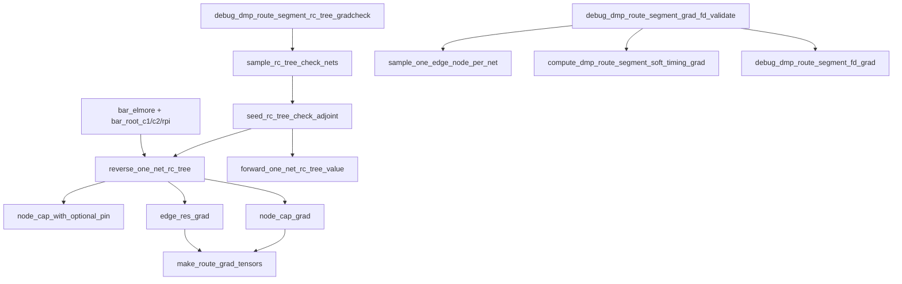

| Function | Upstream | Data in | Data out / effect |
| --- | --- | --- | --- |
| `node_cap_with_optional_pin()` | RC reverse and RC forward check | timer, graph, net id, node id, attr | Node cap including pin cap when route graph keeps pin caps separate. |
| `reverse_one_net_rc_tree()` | Main analytic API loop; RC-tree check | one net route tree, `bar_elmore`, `bar_root_c1/c2/rpi`, `rc_time_factor` | Accumulates edge resistance and node capacitance gradients in place. |
| `make_route_grad_tensors()` | Main analytic API after all nets | host `edge_res_grad`, `node_cap_grad`, graph topology | Cloned output tensors; derives `edge_cap_grad` as endpoint-node average. |
| `sample_rc_tree_check_nets()` | RC-tree-only validation | graph, sample count, seed | Deterministic sampled net/edge/node triples. |
| `route_grad_check_weight()` | RC-tree-only validation seed/forward | net id, object id, attr, channel | Deterministic pseudo-random scalar weight. |
| `seed_rc_tree_check_adjoint()` | RC-tree-only validation | samples, graph, timer | Seeds synthetic `bar_elmore` and `bar_root_*` adjoints. |
| `route_grad_rc_tree_node_cap_base()` | RC-tree-only validation | graph, node | Cap scale for node finite-difference epsilon. |
| `route_grad_rc_tree_safe_rel_err()` | RC-tree-only validation | FD value, adjoint value | Stable relative error. |
| `forward_one_net_rc_tree_value()` | RC-tree-only validation | graph, net, synthetic adjoints | Scalar forward value for checking `reverse_one_net_rc_tree()`. |
| `dmp_route_segment_rc_tree_gradcheck_columns()` | RC-tree-only validation API | none | Column names for RC-tree check tensor. |
| `GPUTimer::debug_dmp_route_segment_rc_tree_gradcheck()` | Python/debug caller | route file, sample count, seed, eps | Runs fixed-topology RC-tree FD vs reverse comparison. |
| `sample_one_edge_node_per_net()` | full FD validation | graph, sample count, seed | Deterministic sample list for end-to-end FD. |
| `safe_rel_err()` | full FD validation | FD value, analytic value | Stable relative error. |
| `tensor_value()` | full FD validation | tensor, row, col | Scalar extraction from FD result tables. |
| `dmp_route_segment_grad_fd_validate_columns()` | full FD validation API | none | Column names for full validation tensor. |
| `GPUTimer::debug_dmp_route_segment_grad_fd_validate()` | Python/debug caller | route file, sample count, eps, tau | Compares sampled full objective FD gradients with analytic tensors. |

### 12.9 Header Inline Device Helpers

| Function | Upstream | Data in | Data out / effect |
| --- | --- | --- | --- |
| `routeGradFinitePositiveOr()` | threshold helpers | value, fallback | Returns value if finite and positive, else fallback. |
| `routeGradBetterCandidate()` | primitive winner selection | candidate value, current best, mode | Boolean winner update decision. |
| `routeGradRootParamStep()` | local FD diagnostics | parameter value | Perturbation step for root RC/input slew FD. |
| `routeGradPrimitiveStatInc()` | primitive analytic/fail paths | optional counter pointer, index | Atomic increment when stats are enabled. |
| `routeGradLowerBoundFloat()` | LUT interpolation | sorted float axis, value | Lower-bound index. |
| `routeGradSlopeFromSamples()` | local FD diagnostics | base/plus/minus samples and eps | Centered or one-sided finite-difference slope. |

## 13. Build Note

`cpp_to_py/gputimer/CMakeLists.txt` uses `GLOB_RECURSE` for `.cu` files and caches the result at configure time. If `.cu` files are added, removed, or renamed in this directory, rerun CMake before building.
